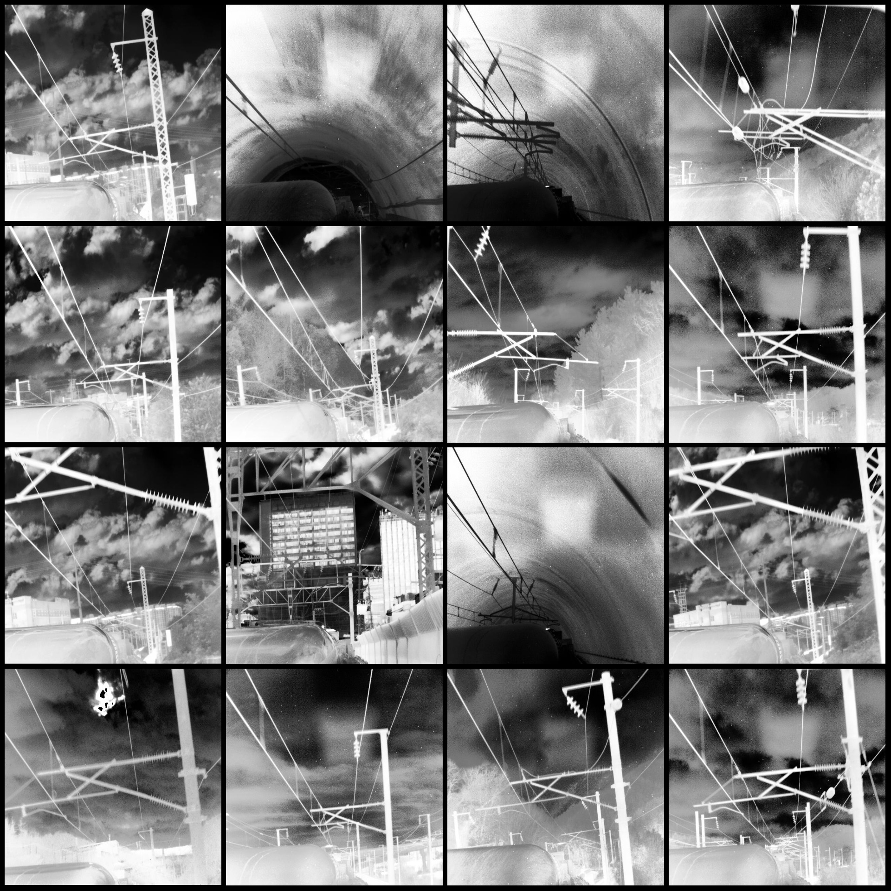
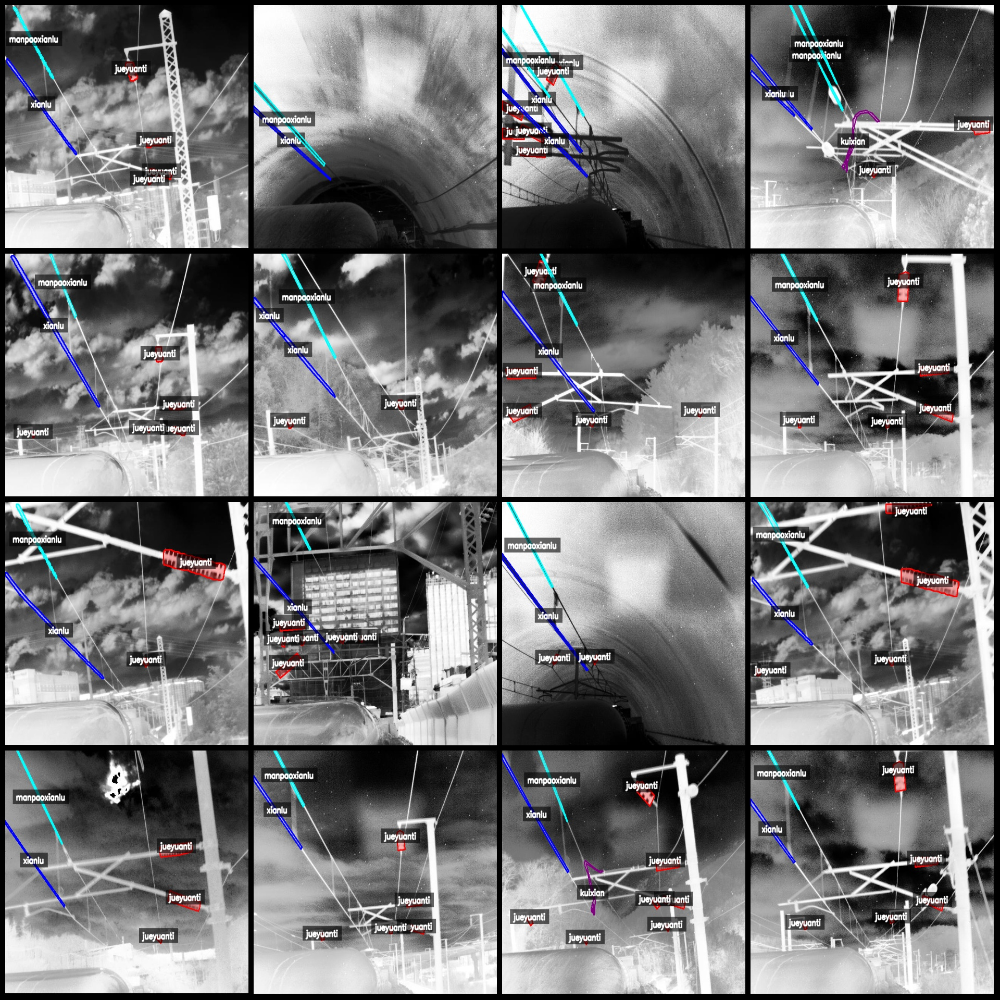
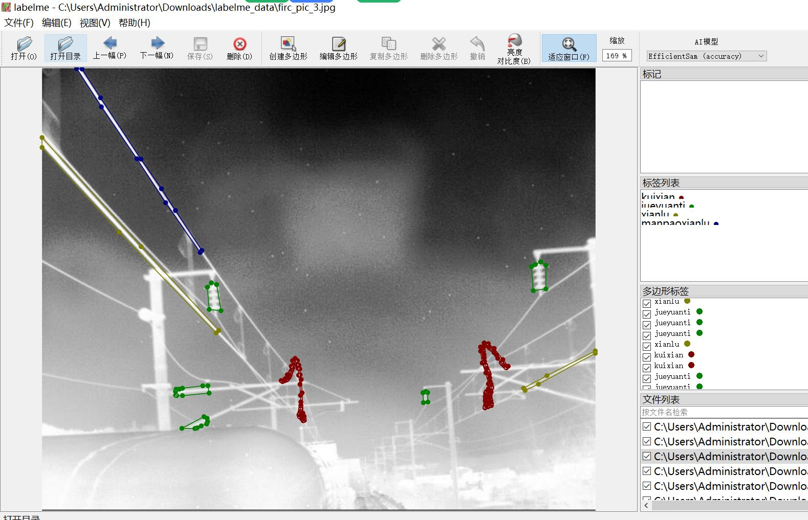

# Power Scene Infrared Image Power Transmission Line Part Component Identification and Segmentation Data Set in labelme Format - 1488 Categories

Dataset Format: labelme format (excluding mask files, only containing jpg images and corresponding json files)
Image Counts (Number of jpg files): 1488
Annotation Counts (Number of json files): 1488
Number of Annotation Categories: 4
Annotation Category Names: ["jueyuanti", "kuixian", "manpaoxianlu", "xianlu"]
Corresponding Chinese Category Names: ["insulator", "feeder", "motor-axle line", "line"]
Count of Boxes per Category:
jueyuanti count = 5898
kuixian count = 186
manpaoxianlu count = 1594
xianlu count = 1652
Total Boxes: 9330
Labelme Version: 5.5.0
Image Resolution: 640x512
Annotation Rules: Polygon boxes are drawn around the categories.
Important Notice: The dataset can be opened and edited in labelme, but the json dataset needs to be converted into mask or yolo format or coco format for semantic segmentation or instance 
segmentation.
Special Remark: This dataset does not guarantee the accuracy of the trained models or weight files.
Image Preview:
Annotation Example:
Original Images (randomly selected 16 images):
Annotation Drawing Results:
Labelme Editing Example:

## Images

Here is a pay link on Stripe ( https://buy.stripe.com/3cs8yP7sY87d0vu9AB ). Please contact me lonlonago@foxmail.com after funding $89, and I will send you a complete data files , thank you!

